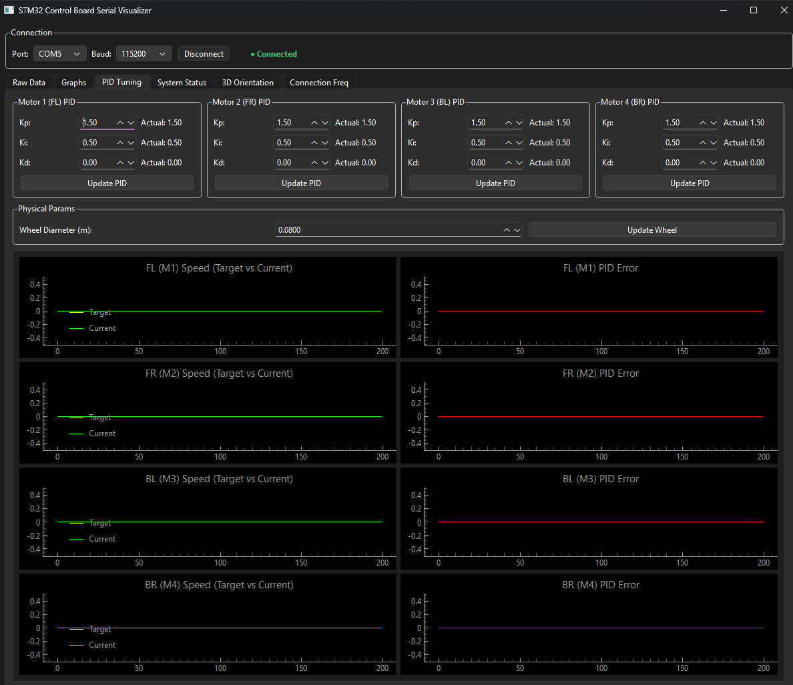
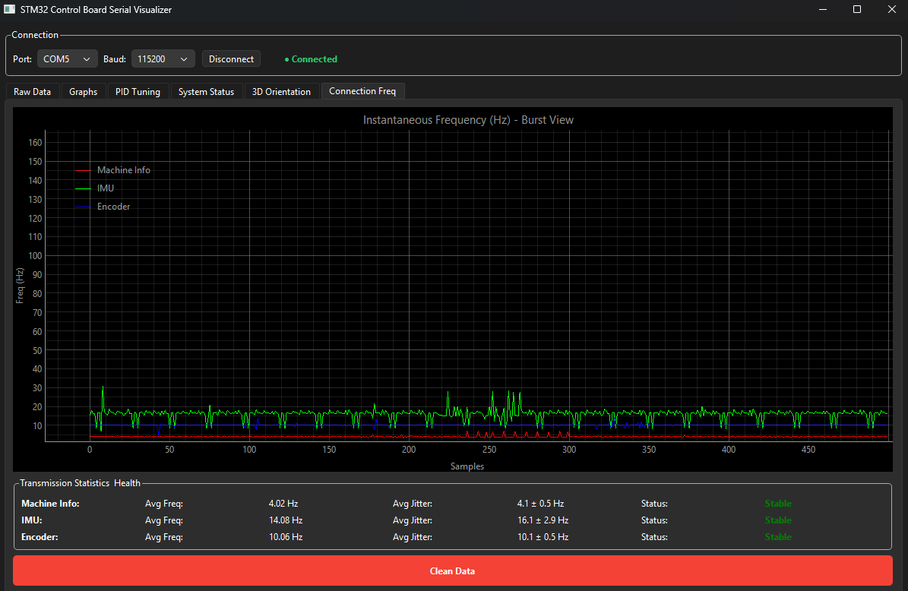

# STM32F103 ROS Board Control

This project implements the firmware for a Yahboom control board based on the STM32F103 to made a ROS-compatible robot controller. 

The system uses a binary Serial UART protocol for communication between the PC and the microcontroller, required a Serial ROS node to be running on the PC to receive and decode the data. It includes a Python-based Graphical User Interface (GUI) for real-time monitoring and control that can be used to send commands to the board and view the telemetry data. 


https://www.yahboom.net/study/ROS-Driver-Board

## 📚 Documentation

For more detailed information about the system design and protocols, please refer to the following documents:

- [**Architecture Overview**](docs/architecture.md): High-level system design and component interactions.
- [**Abstraction Layers**](docs/abstraction_layers.md): Detailed explanation of the modular firmware structure (App, BSP, Core).
- [**Serial Topics**](docs/serial_topics.md): Specification of the binary communication protocol used for PC-Board telemetry and control.


## 🚀 Key Features

### Firmware (STM32)
- **Layered Architecture**: Organized into **App** (logic) and **BSP** (hardware) layers for maximum modularity and portability.
- **RTOS Powered**: Built on **FreeRTOS** (CMSIS-RTOS2) for deterministic task scheduling and real-time responsiveness.
- **Advanced Motor Control**: Direct control of 4 DC motors with per-motor **PID speed control**, encoder feedback, and kinematics processing.
- **Sensor Fusion & Orientation**: Real-time processing for **ICM20948** (Accel/Gyro) and **AK09916** (Mag) with tilt compensation (Roll/Pitch/Yaw).
- **Persistent Storage**: Save/Load PID gains and system configurations to **Flash Memory** (simulating EEPROM) via a custom Storage layer.
- **SerialROS Protocol**: Low-latency binary protocol with **XOR Checksum** for robust PC-Microcontroller communication.
- **Performance Optimized**: Uses **DMA (Direct Memory Access)** for UART communication to minimize CPU load.
- **Safety First**:
  - Integrated **System Watchdog (IWDG)** for fail-safe operation.
  - **Command Timeouts**: Automatic emergency stop if communication with the PC is lost.
  - **Hardware Error Hooks**: Real-time monitoring of battery voltage and sensor health.
- **User Interface**: Support for status **LEDs**, **Buzzer** alerts, and user **Keys** with debouncing.

### Visualization GUI (Python)
- **Modular Design**: Modern Python architecture using **PyQt6** for a responsive and clean user interface.
- **Real-Time Instrumentation**: Dashboard for telemetry visualization, including battery, temperature, and motion status.
- **3D Orientation Viewer**: Real-time representation of the robot's spatial orientation using IMU data.
- **Advanced Control**: Full control over robot modes (Manual/Auto), velocity commands, and emergency stop.
- **Dynamic Configuration**: Modify PID parameters and system settings on-the-fly via the serial link.

### GUI Gallery
|  |  |
|---|---|
| Dashboard Raw Data | IMU Data |
|  |  |
| System Status | 3D Orientation |
|  |  |
| PID Control | Connection Frequency |
|  |  |

## 📂 Project Structure

```text
├── App/                    # Application layer firmware (High-level logic)
│   ├── Main/               # System manager, FSM, and task control
│   ├── Motor/              # Kinematics and speed processing
│   ├── Imu/                # Orientation and tilt algorithms
│   ├── SerialROS/          # Protocol state machine and serialization
│   ├── Storage/            # Persistent settings management
│   ├── Watchdog/           # Independent Watchdog (IWDG) management
│   ├── IO/                 # User interface (Buzzer, Key, Led)
│   ├── Debug/              # Logging and debug utilities
│   └── PID/                # Generic PID control implementation
├── Core/                   # Hardware initialization (STM32CubeMX generated)
├── Drivers/
│   ├── BSP/                # Board Support Package (Hardware Abstraction)
│   │   ├── motor/          # PWM and Encoder drivers
│   │   ├── imu/            # I2C sensor communications
│   │   ├── storage/        # Flash R/W operations
│   │   └── ...             # Drivers for LED, Key, Buzzer, ADC, etc.
│   ├── STM32F1xx_HAL/      # ST Hardware Abstraction Layer
│   └── CMSIS/              # ARM Cortex-M Core definitions (STM32CubeMX generated)
├── scripts/
│   └── SerialVisualizer/   # Python-based diagnostic and control GUI
│       ├── src/            # GUI source code
│       ├── launch.bat/sh   # Quick start scripts
│       └── requirements.txt # Python dependencies
├── docs/                   # Documentation and project media
│   └── media/              # Images for README and documentation
└── yahboom-stm32f103-ros-boardcontrol.ioc # CubeMX configuration file
```

---

## 🛠️ Quick Start

### Firmware
1. The project is developed using Visual Studio Code and STM32CubeMX with STM32Cube extensions.
2. Compile and flash the firmware onto the Yahboom STM32F103 board.
3. The board will start broadcasting telemetry data through the main serial port.

### Graphical Interface (GUI)
The GUI is located in the `scripts/SerialVisualizer` folder.

#### Windows
Run the automated script:
```cmd
.\scripts\SerialVisualizer\launch.bat
```

#### Linux / macOS
```bash
chmod +x ./scripts/SerialVisualizer/launch.sh
./scripts/SerialVisualizer/launch.sh
```

## 📡 Communication Protocol (SerialROS)

The system uses a binary frame format (More details in the [serial_topics.md](docs/serial_topics.md) document):

- **Header**: `0xAA 0x55`
- **Topic ID**: Identifier for the data type (IMU, Encoders, CmdVel, etc.)
- **Payload**: Topic-specific data.
- **Checksum**: Verification sum for data integrity.

### Main Topics
| ID | Topic | Direction | Description |
|---|---|---|---|
| 0x01 | MACHINE_INFO | Board -> PC | System state, battery, errors. |
| 0x02 | IMU | Board -> PC | Accelerometer and gyroscope data. |
| 0x03 | ENCODER | Board -> PC | Accumulated values from the 4 encoders. |
| 0x04 | CMD_VEL | PC -> Board | Velocity commands (linear and angular). |
| 0x08 | E-STOP | PC -> Board | Immediate emergency stop. |

## ⚖️ License
This project is under the MIT License. See the [LICENSE](LICENSE) file for details.

