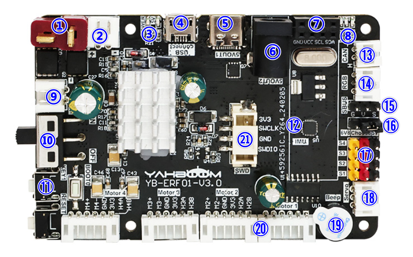
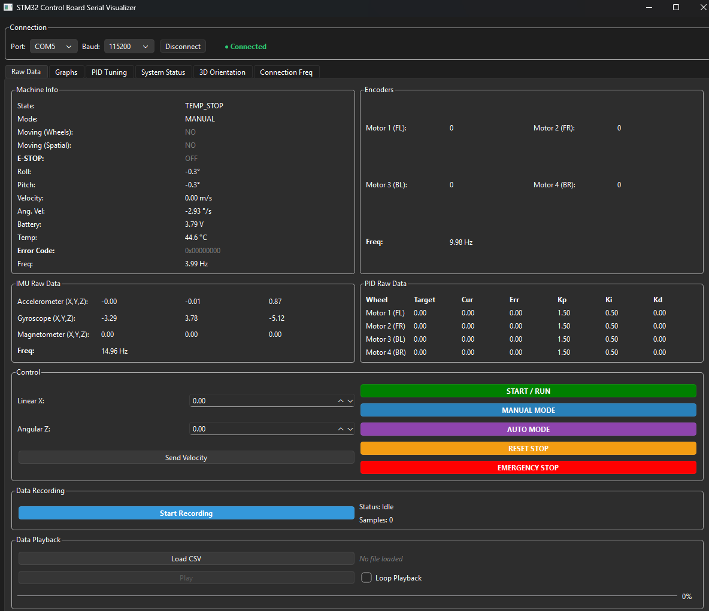
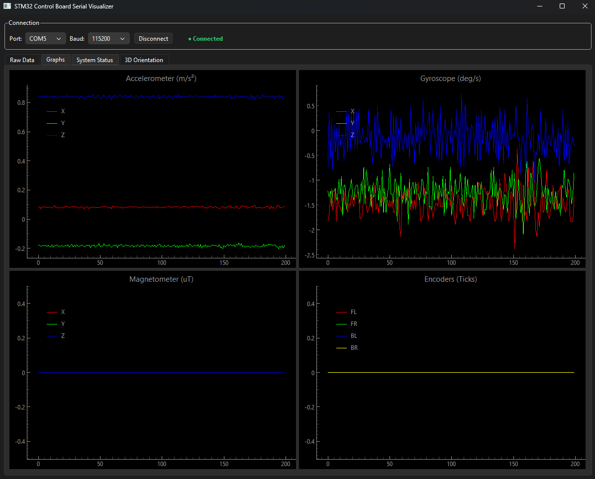
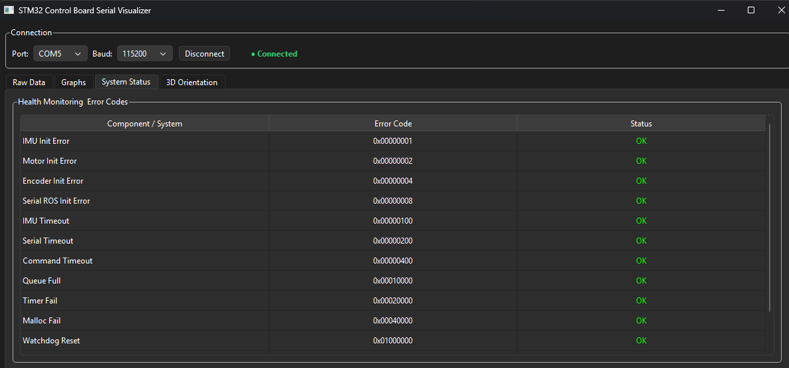
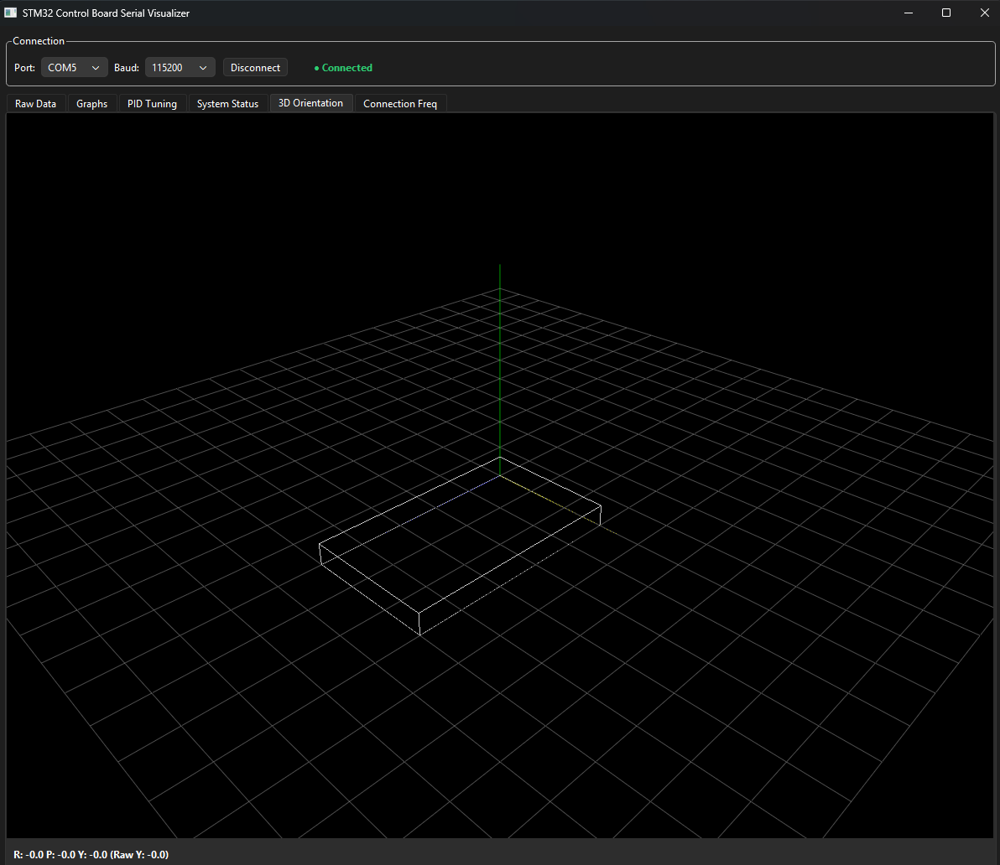

# STM32F103 ROS Board Control



This project implements the firmware for a Yahboom control board based on the STM32F103, designed for ROS-compatible robots. It includes a Python-based Graphical User Interface (GUI) for real-time monitoring and control.

https://www.yahboom.net/study/ROS-Driver-Board


## 🚀 Key Features

### Firmware (STM32)
- **Motor Control**: Support for 4 motors with PID speed control.
- **Sensor Integration**: IMU (ICM20948/AK09916) and quadrature encoder reading.
- **SerialROS Protocol**: Robust and efficient communication using serial frames with checksum.
- **State Management**: State system (IDLE, MOVING, E_STOP) with safety protections.
- **Watchdog & Timeouts**: Automatic motor stop if communication is lost.

### Visualization GUI (Python)
- **Real-Time Dashboard**: Visualization of telemetry (acceleration, angular velocity, encoders).
- **3D Viewer**: Visual representation of the robot's orientation.
- **Remote Control**: Sending `cmd_vel` commands, mode switching, and emergency stop.
- **Data Logging**: Telemetry export to CSV files for later analysis.

### GUI Gallery
| Dashboard & 3D | Raw Data & Control |
|---|---|
|  |  |
| **System Status** | **Data Recording** |
|  |  |

## 📂 Project Structure

```text
├── App/                    # Application layer firmware
│   ├── Main/               # Core logic: task management and state machine
│   ├── SerialROS/          # SerialROS protocol implementation
│   ├── Imu/                # IMU sensor abstraction and data processing
│   ├── Motor/              # Motor driver and encoder integration
│   ├── PID/                # Generic PID control algorithm
│   ├── IO/                 # Hardware peripherals (LED, Key, Buzzer)
│   ├── Watchdog/           # System health monitoring (IWDG)
│   └── Debug/              # Unified logging and debug utilities
├── Core/                   # Low-level hardware initialization (CubeMX generated)
│   ├── Src/                # Main loop and interrupt handlers
│   └── Inc/                # System-wide hardware headers
├── Drivers/                # STM32 HAL and CMSIS drivers
├── scripts/
│   └── SerialVisualizer/   # Python-based diagnostic and control GUI
│       ├── src/            # GUI source code
│       ├── launch.bat/sh   # Quick start scripts
│       └── requirements.txt # Python dependencies
├── docs/                   # Documentation and project media
│   └── media/              # Images for README and documentation
└── yahboom-stm32f103-ros-boardcontrol.ioc # CubeMX configuration file
```

## 🛠️ Quick Start

### Firmware
1. The project is made with Visual Studio Code and STM32CubeMX, using STM32Cube extensions.
2. Compile and flash the firmware onto the Yahboom STM32F103 board.
3. The board will start broadcasting data through the main serial port.

### Graphical Interface (GUI)
The GUI is located in the `scripts/SerialVisualizer` folder.

#### Windows
Run the automated script:
```cmd
.\scripts\SerialVisualizer\launch.bat
```

#### Linux / macOS
```bash
chmod +x ./scripts/SerialVisualizer/launch.sh
./scripts/SerialVisualizer/launch.sh
```

## 📡 Communication Protocol (SerialROS)

The system uses a binary frame format:
- **Header**: `0xAA 0x55`
- **Topic ID**: Identifier for the data type (IMU, Encoders, CmdVel, etc.)
- **Payload**: Topic-specific data.
- **Checksum**: Verification sum for data integrity.

### Main Topics
| ID | Topic | Direction | Description |
|---|---|---|---|
| 0x01 | MACHINE_INFO | Board -> PC | System state, battery, errors. |
| 0x02 | IMU | Board -> PC | Accelerometer and gyroscope data. |
| 0x03 | ENCODER | Board -> PC | Accumulated values from the 4 encoders. |
| 0x04 | CMD_VEL | PC -> Board | Velocity commands (linear and angular). |
| 0x08 | E-STOP | PC -> Board | Immediate emergency stop. |

## ⚖️ License
This project is under the MIT License. See the [LICENSE](LICENSE) file for details.
