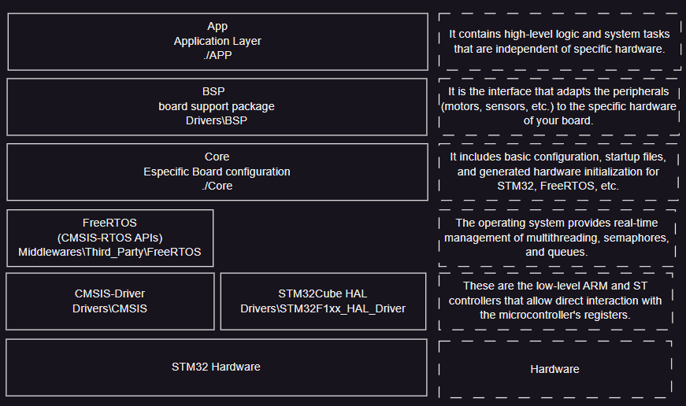

# Abstraction Layers

This document explains the software stack and the different abstraction layers used in the project to ensure modularity, portability, and ease of maintenance.

## Overview of Layers

### 1. App - Application Layer (`./APP`)
It contains high-level logic and system tasks that are independent of specific hardware.
- **Key Files**: `task_manager.c`, `task_controller.c`, `task_motion.c`, etc.

### 2. BSP - Board Support Package (`Drivers\BSP`)
It is the interface that adapts the peripherals (motors, sensors, etc.) to the specific hardware of your board.
- **Key Files**: `bsp_motor.c`, `bsp_serial_ros.c`, `bsp_adc.c`, etc.

### 3. Core - Specific Board Configuration (`./Core`)
It includes basic configuration, startup files, and generated hardware initialization for STM32, FreeRTOS, etc.
- **Key Files**: `main.c`, `stm32f1xx_it.c`, `system_stm32f1xx.c`.

### 4. FreeRTOS (CMSIS-RTOS APIs) (`Middlewares\Third_Party\FreeRTOS`)
The operating system provides real-time management of multithreading, semaphores, and queues.

### 5. Low-Level Layers
These are the low-level ARM and ST controllers that allow direct interaction with the microcontroller's registers.
- **CMSIS-Driver** (`Drivers\CMSIS`)
- **STM32Cube HAL** (`Drivers\STM32F1xx_HAL_Driver`)

### 6. STM32 Hardware
Physical hardware (STM32F103 Microcontroller and connected components).