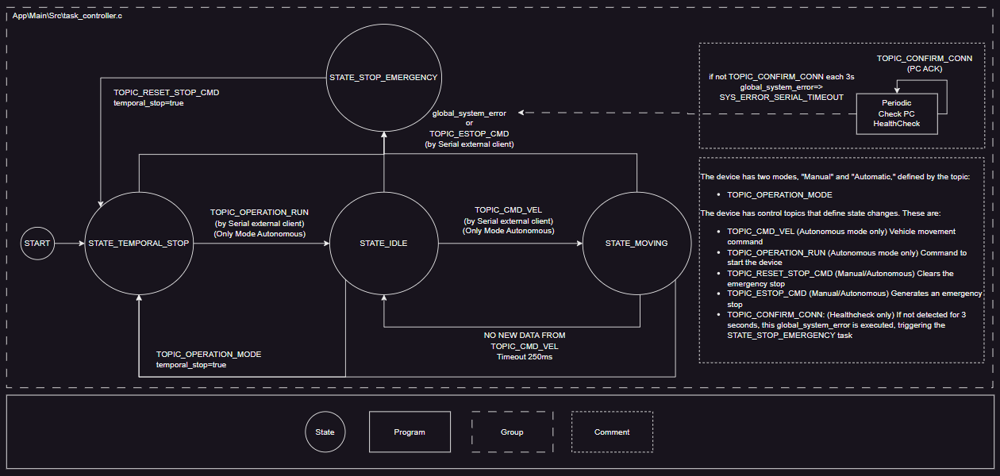
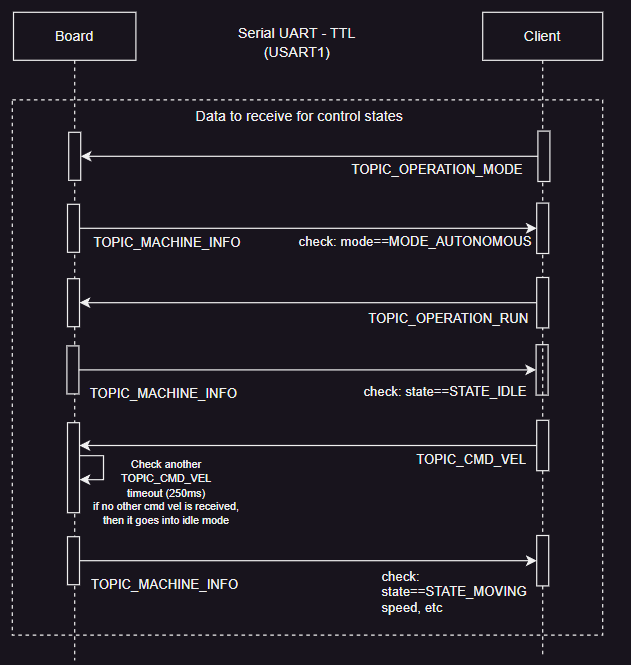

# System Architecture Documentation

This document provides a high-level overview of the software architecture for the Yahboom STM32 ROS board control system.

- [Architectural Layers](#architectural-layers)
- [State Machine](#state-machine)
- [Start Sequence](#start-sequence)

## Architectural Layers

The system is organized into four distinct layers to promote modularity and hardware independence:

| Layer | Description |
|-------|-------------|
| **App** | Contains the high-level business logic, FreeRTOS tasks, and state machine management. |
| **BSP (Board Support Package)** | Provides a hardware-independent API for the App layer, abstracting the specific STM32 HAL calls. |
| **Middlewares** | Includes third-party libraries like FreeRTOS and CMSIS-RTOS2. |
| **Core / HAL** | Contains the low-level STM32 HAL (Hardware Abstraction Layer) and peripheral configuration generated by STM32CubeMX. |

---

## State Machine

The robot operates under a centralized state machine managed by the **AppManager**, as shown in the following diagram from [task_controller.c](../App\Main\Src\task_controller.c)

### States and Transitions

| Source State | Target State | Trigger / Condition |
|--------------|--------------|---------------------|
| **START** | `STATE_TEMPORAL_STOP` | System Initialization |
| `STATE_TEMPORAL_STOP` | `STATE_IDLE` | `TOPIC_OPERATION_RUN` received (Autonomous Mode) |
| `STATE_IDLE` | `STATE_MOVING` | `TOPIC_CMD_VEL` received (Autonomous Mode) |
| `STATE_IDLE` | `STATE_STOP_EMERGENCY` | `global_system_error` OR `TOPIC_ESTOP_CMD` received |
| `STATE_MOVING` | `STATE_IDLE` | No new data from `TOPIC_CMD_VEL` (Timeout 250ms) |
| `STATE_MOVING` | `STATE_STOP_EMERGENCY` | `global_system_error` OR `TOPIC_ESTOP_CMD` received |
| `STATE_IDLE` | `STATE_TEMPORAL_STOP` | `TOPIC_OPERATION_MODE` received |
| `STATE_IDLE` | `STATE_STOP_EMERGENCY` | `global_system_error` OR `TOPIC_ESTOP_CMD` received |
| `STATE_STOP_EMERGENCY` | `STATE_TEMPORAL_STOP` | `TOPIC_RESET_STOP_CMD` received |

### Key Control Logic

- **Connection Health Check (PC ACK):** The system expects a `TOPIC_CONFIRM_CONN` message every 3 seconds. If this heartbeat is missing, it triggers `SYS_ERROR_SERIAL_TIMEOUT`, which leads to `STATE_STOP_EMERGENCY`.
- **Operating Modes:**
    - **Manual:** Direct hardware interference or specific manual overrides.
    - **Autonomous:** Responds to serial commands (`TOPIC_CMD_VEL`, `TOPIC_OPERATION_RUN`).
- **Safety Mechanisms:**
    - **CMD_VEL Timeout:** If communications cease for more than 250ms while moving, the robot automatically returns to `IDLE`.
    - **Emergency Stop:** Can be triggered by hardware errors or an external serial command (`TOPIC_ESTOP_CMD`). Also can be triggered by the emergency stop button KEY1.
---

## FreeRTOS Task Architecture

The system utilizes several concurrent tasks to handle timing-critical operations:

| Task Name | Priority | Frequency | Description |
|-----------|----------|-----------|-------------|
| **AppController** | High | Asynchronous | Controller states of FSM (AppManager) Processes incoming Serial ROS messages and updates the `system_msg_queue`. |
| **AppManager** | BelowNormal | 100Hz | Main state machine, motor control loops, and periodic status reporting. |
| **AppMotion** | BelowNormal | 20Hz | Analyzes IMU and encoder data to update `is_moving_wheels` and `is_moving_spatial`. |
| **AppIMU** | Normal | 50Hz | Reads raw IMU data and publishes it over the serial link. |
| **AppEncoder** | BelowNormal | 10Hz | Reads wheel encoders and publishes raw counts. |
| **AppHearthbeat** | Low | 1Hz | Toggles the onboard heart-beat LED. |

### Inter-Task Communication

- **System Message Queue (`system_msg_queue`):** Used primarily by the Controller task to send state change requests (e.g., E-STOP, Mode Switch) to the Manager task.
- **Global Shared Variables:** Used for high-frequency data sharing (e.g., `machine_info`, `last_cmd`, `g_encoder_counts`).

---

## Start Sequence

The following diagram illustrates the boot process and initialization sequence of the system to move the robot:

This change the operation mode to autonomous mode (TOPIC_OPERATION_MODE=MODE_AUTONOMOUS (1)) and a run command (TOPIC_OPERATION_RUN=0x00) to set the robot state to STATE_IDLE, then with a velocity command (TOPIC_CMD_VEL) the robot will move to the state MOVING. 

---