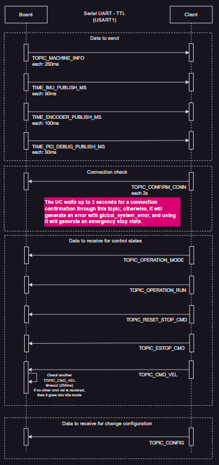

# Serial ROS Topics Documentation

This document describes the communication protocol and topics used between the STM32 robot controller and the host PC over serial.

> [!NOTE]
> **Conceptual Note:** While this document uses the term "Topics", these are **not** native ROS topics. They are a logical representation within a custom Serial ROS protocol designed for lightweight communication. A bridge or node on the PC side is responsible for mapping these IDs to actual ROS topics if needed.



## Serial Frame Structure

All messages follow a fixed frame format:

| Byte | Field | Description |
|------|-------|-------------|
| 0    | Header 1 | `0xAA` |
| 1    | Header 2 | `0x55` |
| 2    | Topic ID | Unique identifier for the topic |
| 3    | Length | Length of the payload (N bytes) |
| 4..N+3 | Payload | Raw data (binary) |
| N+4  | Checksum | XOR of `topic_id ^ length ^ payload[0..N-1]` |

---

## Published Topics (Robot -> PC)

These topics are sent periodically from the STM32 to the PC.

### 0x01: TOPIC_MACHINE_INFO
General system status and telemetry.
- **Frequency:** 4Hz (`TIME_MACHINE_INFO_PUBLISH_MS = 250`)
- **Structure:** `machine_info_t`
```c
typedef struct {
    system_state_t state;       // Current state (IDLE, MOVING, STOP_EMERGENCY, etc.)
    operation_mode_t mode;      // Mode (MANUAL, AUTONOMOUS)
    bool is_moving_wheels;      // Wheels are rotating
    bool is_moving_spatial;     // IMU detects movement
    bool estop;                 // Emergency Stop active
    uint32_t error_code;        // Global system error flags
    float roll;                 // Roll tilt (degrees)
    float pitch;                // Pitch tilt (degrees)
    float velocity;             // Average linear velocity (m/s)
    float battery;              // Battery voltage (V)
    float temperature;          // Internal temperature (°C)
    float angular_velocity;     // Yaw rate (°/s)
} machine_info_t;
```

#### Example Serial Frame
State: `IDLE`, Mode: `AUTONOMOUS`, Velocity: `0.0`, Battery: `12.5V`
`AA 55 01 2C 00 00 00 00 01 00 00 00 00 00 00 00 00 00 00 00 00 00 00 00 00 00 00 00 00 00 00 00 00 00 00 00 00 00 48 41 00 00 00 00 00 00 00 00 6A`
*(Note: 44 bytes payload)*

### 0x02: TOPIC_IMU
Raw IMU sensor data.
- **Frequency:** 20Hz (`TIME_IMU_PUBLISH_MS = 50`)
- **Structure:** `imu_data_t`
```c
typedef struct {
    float acc[3];   // Accelerometer [x, y, z] (g)
    float gyro[3];  // Gyroscope [x, y, z] (deg/s)
    float mag[3];   // Magnetometer [x, y, z] (uT)
} imu_data_t;
```

#### Example Serial Frame
Accelerations: `[0, 0, 1.0]g`, Others: `0.0`
`AA 55 02 24 00 00 00 00 00 00 00 00 00 00 80 3F 00 00 00 00 00 00 00 00 00 00 00 00 00 00 00 00 00 00 00 00 00 00 00 00 BB`
*(Note: 36 bytes payload)*

### 0x03: TOPIC_ENCODER
Raw encoder counts from all 4 wheels.
- **Frequency:** 10Hz (`TIME_ENCODER_PUBLISH_MS = 100`)
- **Structure:** `int32_t[4]`
- `[FL, FR, BL, BR]` (Front-Left, Front-Right, Back-Left, Back-Right)

#### Example Serial Frame
Counts: `[100, 200, 300, 400]`
`AA 55 03 10 64 00 00 00 C8 00 00 00 2C 01 00 00 90 01 00 00 24`
*(Note: 16 bytes payload)*

### 0x09: TOPIC_PID_DEBUG
Internal PID controller debugging data.
- **Frequency:** 20Hz (`TIME_PID_DEBUG_PUBLISH_MS = 50`)
- **Structure:** `pid_debug_msg_t`
```c
typedef struct {
    float target[4];    // Target velocities
    float current[4];   // Current measured velocities
    float error[4];     // PID error per motor
    float kp[4];        // Active Kp gain
    float ki[4];        // Active Ki gain
    float kd[4];        // Active Kd gain
} pid_debug_msg_t;
```

#### Example Serial Frame
Example target: `1.0` on all motors, others zero.
`AA 55 09 60 00 00 80 3F 00 00 80 3F 00 00 80 3F 00 00 80 3F [Rest of 80 zeros...] 36`
*(Note: 96 bytes payload)*

---

## Subscribed Topics (PC -> Robot)

These topics are processed by the STM32 when received from the PC.

### 0x04: TOPIC_CMD_VEL
Movement commands (usually from ROS `cmd_vel`).
- **Required Mode:** `AUTONOMOUS`
- **Structure:** `cmd_vel_t`
```c
typedef struct {
    float linear_x;
    float linear_y;     // Reserved
    float linear_z;     // Reserved
    float angular_z;    // Yaw command
} cmd_vel_t;
```

#### Example Serial Frame
Command: `linear_x = 0.5`, `angular_z = 0.1`
`AA 55 04 10 00 00 00 3F 00 00 00 00 00 00 00 00 CD CC CC 3D 19`
*(Note: 16 bytes payload)*

### 0x05: TOPIC_OPERATION_MODE
Switch between control modes.
- **Payload:** `uint8_t`
- `0x00`: `MODE_MANUAL`
- `0x01`: `MODE_AUTONOMOUS`

#### Example Serial Frame (Set Autonomous)
`AA 55 05 01 01 05`

### 0x06: TOPIC_OPERATION_RUN
Manual start/stop control.
- **Payload:** `uint8_t` (requested `system_state_t`)
- `0x00`: `STATE_IDLE` (Stop movement)

#### Example Serial Frame (Stop)
`AA 55 06 01 00 07`

### 0x07: TOPIC_RESET_STOP_CMD
Resets the system state from an error or manual stop to `STATE_TEMPORAL_STOP`.
- **Payload:** `uint8_t` (Any value)

#### Example Serial Frame
`AA 55 07 01 00 06`

### 0x08: TOPIC_ESTOP_CMD
Triggers a software Emergency Stop.
- **Payload:** `uint8_t` (Any value)

#### Example Serial Frame
`AA 55 08 01 01 08`

### 0x0A: TOPIC_CONFIRM_CONN
Heartbeat from PC to keep the connection alive.
- **Requirement:** Must be received within `CONN_TIMEOUT_MS` (3000ms) to avoid automatic E-STOP.
- **Payload:** `uint8_t` (Any value)

#### Example Serial Frame
`AA 55 0A 01 00 0B`

### 0x0B: TOPIC_CONFIG
Update internal parameters (PID gains, Physical parameters), this data is stored in the 'STORAGE' memory area of the flash memory ([STM32F103XX_FLASH.ld](../STM32F103XX_FLASH.ld)).
- **Structure:** Variable length.
- `payload[0]`: `item_id` (e.g., `0x00..0x03` for PID M1..M4, `0x04` for Wheel Diameter)
- `payload[1..N]`: Data (e.g., 3 floats for PID, 1 float for Wheel Diameter)

#### Example Serial Frame (Set Wheel Diameter to 0.08)
`AA 55 0B 05 04 A4 70 A3 3D D2`
